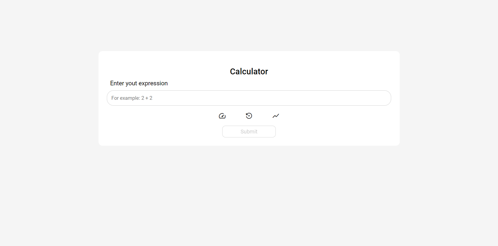
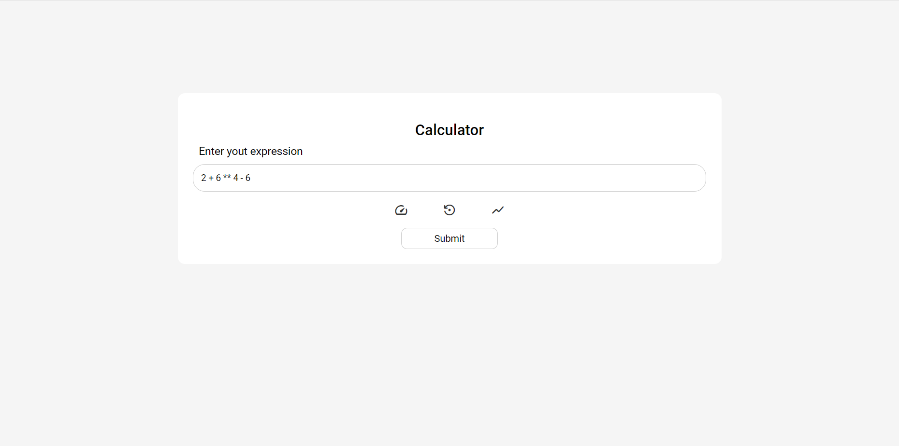
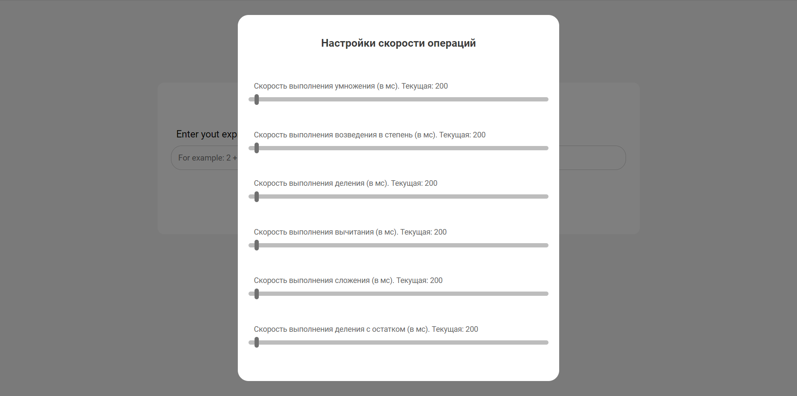
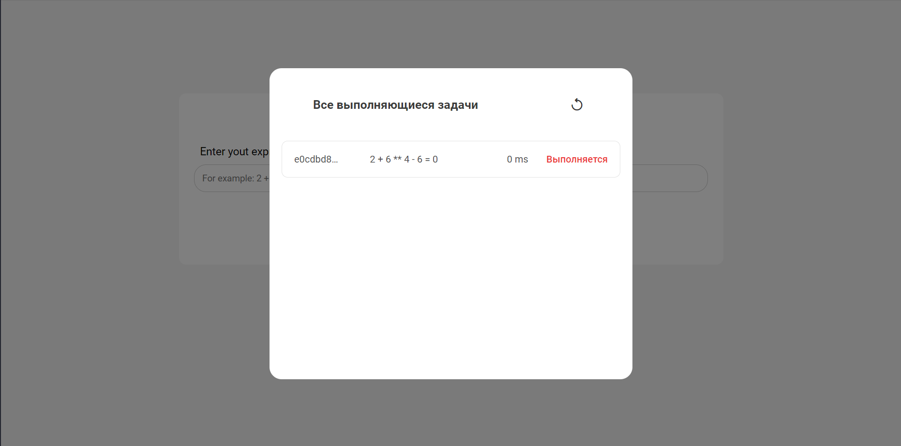
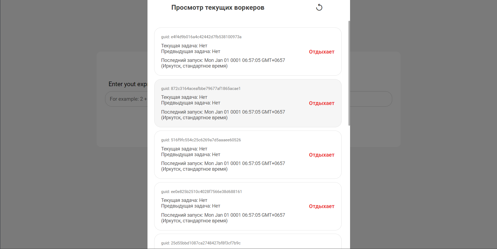

# Expression Calculator

The final project of the second sprint from YandexLMS


## Application Configuration

Before you run everything in Docker, you can play around with the application config ./config.yaml

`expression-service` and `app` - the part of the config that you can interact with. It contains the following fields

### app
| Parameter | Type     | Description                |
| :-------- | :------- | :------------------------- |
| `cache-ttl` | `int` | **Required**. The time in minutes that '\n' expressions will be stored in the DBMS. If it is not necessary, set 0 |


### expression-service
| Parameter        | Type     | Description                |
| :-------------   | :------- | :------------------------- |
| `gorutines-count`| `int`    | **Required**. The number of workers that will be on the server|
| `expr-queue`     | `string` | **Required**. The name of the queue to which expressions from the frontend will arrive |
| `res-queue`      | `string` | **Required**. The name of the queue in which the workers will put the completed tasks| 
| `exchange`       | `string` | **Required**. The name of the exchanger for rabbitmq|
| `route-key`      | `string` | **Required**. The name of the unique key that will be used to send messages to rabbitmq|
|`worker-info-update`| `int` |  **Required**. The time in seconds after which the server will ping the workers|

## Run Locally

Clone the project

```bash
git clone https://github.com/Parside01/ExprCalc.git
```

Go to the project directory

```bash
cd ExprCalc
```

Launching the application in Docker

```bash
docker-compose up --build
```


## After launch

click on the link http://localhost:80

#### Roadmap

When you log in to the app, this will be waiting for you



You can enter a mathematical expression in the input field



Before that, you can set the execution speed of each of the supported mathematical operations



By clicking on the button, you send the expression to the server that processes it, you can monitor the state of the expression



You can also monitor every worker in the system




## How it works

#### Technology stack


#### Frontend
- HTML
- CSS
- [ReactJS](https://reactjs.org/) <br>

<a href="https://reactjs.org/"> </a>

#### Backend

- [Golang](https://golang.org/): <br>
  
<a href="https://golang.org/">  </a>

- [Go-echo](https://github.com/labstack/echo): <br> 

<a href="https://github.com/labstack/echo"></a>

- [RabbitMQ](https://www.rabbitmq.com/) <br>

<a href="https://www.rabbitmq.com/what-is-rabbitmq.html"><a>

- [Redis](https://redis.io/) <br> 


 
#### Docker
- [Docker](https://www.docker.com/) <br>

<a href="https://www.docker.com/"> </a>


