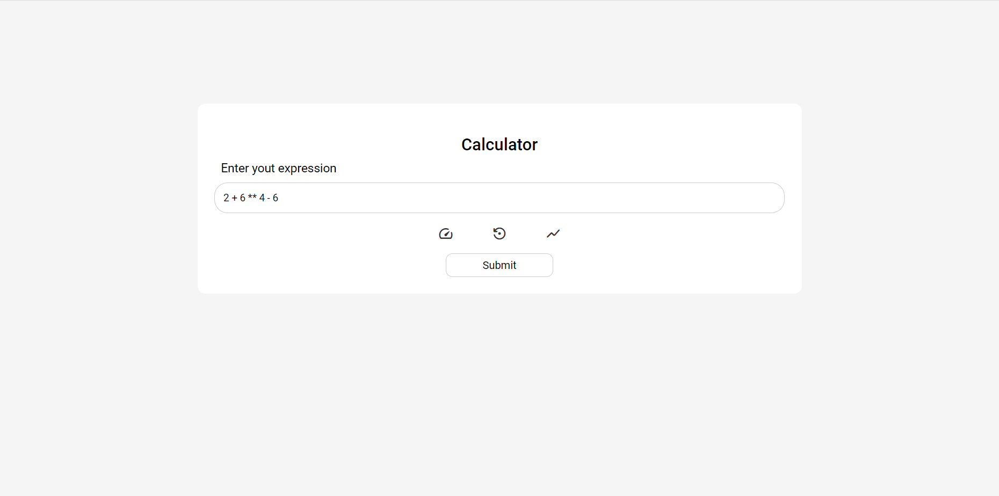
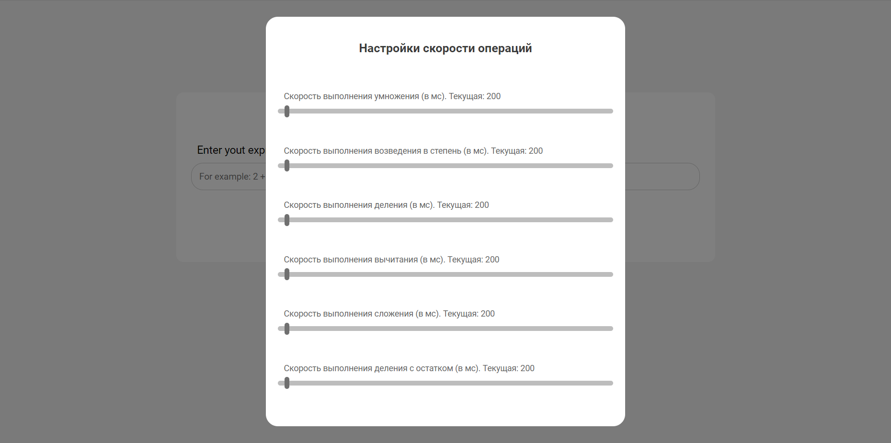

# Expression Calculator

The final project of the second sprint from YandexLMS

## Конфигурация приложения

Прежде чем запускать все в Docker, вы можете поиграть с конфигурацией приложения ./config.yaml

`expression-service` и `app` - часть конфига, которую вы можете взаимодействовать. Она содержит следующие параметры

### app
| Параметр | Тип     | Описание                |
| :------ | :------ | :--------------------- |
| `cache-ttl` | `int` | **Обязательное**. Время в минутах, в течение которого вы хотите хранить выражения в БД |


### expression-service
| Параметр        | Тип     | Описание                |
| :------------- | :------ | :--------------------- |
| `gorutines-count` | `int`    | **Обязательное**. Количество работников, которые будут работать на сервере|
| `expr-queue`     | `string` | **Обязательное**. Имя очереди, в которую будут приходить выражения с frontend|
| `res-queue`      | `string` | **Обязательное**. Имя очереди, в которую будут приходить завершенные задачи|
| `exchange`       | `string` | **Обязательное**. Имя обменника для RabbitMQ|
| `route-key`      | `string` | **Обязательное**. Имя уникального ключа, по которому будут отправляться сообщения в RabbitMQ|
|`worker-info-update`| `int` |  **Обязательное**. Время в секундах, через которое будет обновляться информация о работнике|

## Запуск локально

Клонируйте проект

```bash
git clone https://github.com/Parside01/ExprCalc.git
```

Перейдите в директорию проекта

```bash
cd ExprCalc
```

Запуск приложения в Docker

```bash
docker-compose up --build
```


## После запуска

Нажмите на ссылку http://localhost:80

#### Короткая экскурсия по интерфейсу 

Когда вы заходите в приложение, он будет ожидать вас


Вы можете ввести математическое выражение в поле ввода



Перед этим вы можете установить скорость выполнения каждой из поддерживаемых математических операций




Нажав на кнопку, вы отправляете выражение на сервер, который его обрабатывает, вы можете отслеживать состояние выражения


Вы также можете отслеживать каждого работника в системе


## Как это работает


### Схема работы


### Стек технологий
#### Фронтенд

<a href="https://reactjs.org/"> </a>

#### Бэкенд
<br>
<a href="https://golang.org/">  </a>

<a href="https://github.com/labstack/echo"></a>

<a href="https://www.rabbitmq.com/what-is-rabbitmq.html"><a>


 
#### Докер

<a href="https://www.docker.com/"> </a>

## Обратная связь

если у вас есть какие-либо отзывы или проблемы с приложением, пожалуйста, [откройте проблему] (https://github.com/Parside01/ExprCalc/issues/new) или вы можете написать мне в Telegram @parside12

#### Авторы
+ [Parside01](https://github.com/Parside01) :scream_cat:
+ [Kneepy](https://github.com/Kneepy) :japanese_goblin: